<h3><code>mikhail0vvlad@github ~ $ ./contributions.sh</code></h3>

  

<h3><code>mikhail0vvlad@github ~ $ whoami</code></h3>

<table>
<tr>
<td valign="top"></td>
<td valign="top"></td>
</tr>
</table>

 

<h3><code>mikhail0vvlad@github ~ $ cat contacts.txt</code></h3>

<a href="https://t.me/mikhail0vvlad"><code>telegram</code></a> ·
<a href="https://vk.com/mikhail0vvlad"><code>vk</code></a> ·
<a href="https://github.com/mikhail0vvlad?tab=repositories"><code>repositories</code></a>

